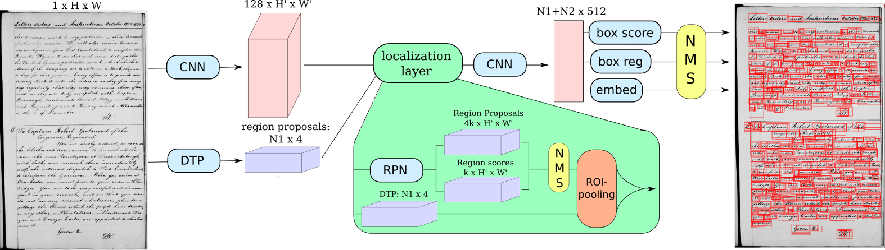

# Neural Ctrl-F: Segmentation-free Query-by-String Word Spotting in Handwritten Manuscript Collections



This repository contains a minimal implementation of the paper

**[Neural Ctrl-F: Segmentation-free Query-by-String Word Spotting in Handwritten Manuscript Collections](https://arxiv.org/abs/1703.07645)**,
<br>
[Tomas Wilkinson]((http://user.it.uu.se/~tomwi522/)\,
[Jonas Lindström]\,
[Anders Brun]
<br>

The paper addresses the problem of **Segmentation-free Word Spotting in Historical Manuscripts**, where a computer detects words on a collection of manuscript pages and allows a user to search within them. The model, dubbed Ctrl-F-Net after the word search keyboard short cut in common document processors, is a deep convolutional neural network trained in an end-to-end fashion.

We provide:

- A [pretrained model](#pretrained-model)
- Code for [Running on a new image](#running-on-a-new-image)
- Instructions for [training a model](#training-on-the-washington-dataset) and evaluating on the Washington dataset

If you find this code useful in your research, please cite:

```
@article{wilkinson2017neural,
  title={Neural Ctrl-F: Segmentation-free Query-by-String Word Spotting in Handwritten Manuscript Collections},
  author={Wilkinson, Tomas and Lindstr{\"o}m, Jonas and Brun, Anders},
  journal={arXiv preprint arXiv:1703.07645},
  year={2017}
}

```

## Installation

Ctrl-F-Net is implemented in [Torch](http://torch.ch/), and depends on the following packages: [torch-hdf5](https://github.com/deepmind/torch-hdf5), [qassemoquab/stnbhwd](https://github.com/qassemoquab/stnbhwd)

After installing torch, you can install these dependencies by running the following:

```bash
luarocks install hdf5
luarocks install https://raw.githubusercontent.com/qassemoquab/stnbhwd/master/stnbhwd-scm-1.rockspec
```

It also has the following python dependencies:
 - numpy
 - scipy
 - h5py
 - scikit-image
 - opencv

which can be installed using the command 
```
pip install numpy scipy skimage h5py opencv
```

### cuDNN

You also need the cuDNN library from NVIDIA. You need to register for the CUDA Developer Program (it's free)
and download the library from [NVIDIA's website](https://developer.nvidia.com/cudnn); you'll also need to install
the [cuDNN bindings for Torch](https://github.com/soumith/cudnn.torch) by running

```bash
luarocks install cudnn
```

## Pretrained model

You can download a pretrained Ctrl-F-Net model by running the following script:

```bash
 sh scripts/download_model.sh
 ```
 
 This will download the model (about 1 GB) to `models/ctrlfnet_washington.t7`

## Running on a new image

Using a downloaded model (or your own), you can search for the word "orders" in a single image using the following command:

```
ipython test_image.py --model checkpoints/ctrlfnet_washington.t7 --query orders
```

The output will be saved as examples/out.png by default. There are further further options in the file test_image.py


## Training on the Washington dataset

To train a new Ctrl-F-Net model, you will first need to download a ctrlfnet model pretrained on the [IIIT-hws-10k synthetic dataset](https://cvit.iiit.ac.in/research/projects/cvit-projects/matchdocimgs) by running:

```bash
 sh scripts/download_pretrained_model.sh
 ```

You can download the Washington dataset from [this link](http://ciir.cs.umass.edu/downloads/gw/gw_20p_wannot.tgz) or using 

```
mkdir -p data/washington/
cd data/washington
wget http://ciir.cs.umass.edu/downloads/gw/gw_20p_wannot.tgz
tar -xzf gw_20p_wannot.tgz
cd ../../
```
Then use the script `preprocess.py` to generate a single HDF5 and accompanying json file containing the entire dataset. It is about 50 GB in size so make sure you have the space. 

```
python preprocess.py --root_dir data/dbs --cross_val 0
```

Use the script `train.lua` to train the model 

```
export THC_CACHING_ALLOCATOR=0
th train.lua -id ctrlfnet_washington_fold1 -dataset washington_fold1_augmented -checkpoint_start_from checkpoints/ctrlfnet_iiit_iter_10000.t7
```

Use the scripts `evaluate_model.lua` to extract region coordinates, scores and descriptors from the test data using the model that you just trained.

```
mkdir -p descriptors
th evaluate_model.lua 
```

Finally, to calculate map scores, run 

```
python evaluate_map.py  
```

and you should get something like this:

```
washington, embedding = dct
Overlap Threshold: 50%                                   25%
QbE MAP: 90.558795, mR: 94.272249           QbE MAP: 97.487887, mR: 99.394434
QbS MAP: 92.971708, mR: 95.704360           QbS MAP: 96.564747, mR: 99.394471

Overlap 50% Recall: 99.449309, RPN recall: 92.394010, RP recall: 97.829975
Overlap 25% Recall: 100.000000, RPN recall: 94.830754, RP recall: 99.569229
```

This code is heavily based on the excellent [DenseCap](https://github.com/jcjohnson/densecap) implementation by Johnson et al 

